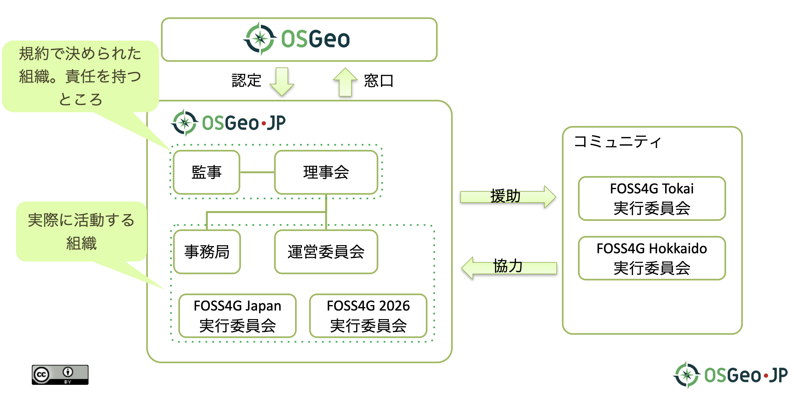
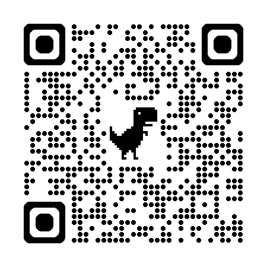
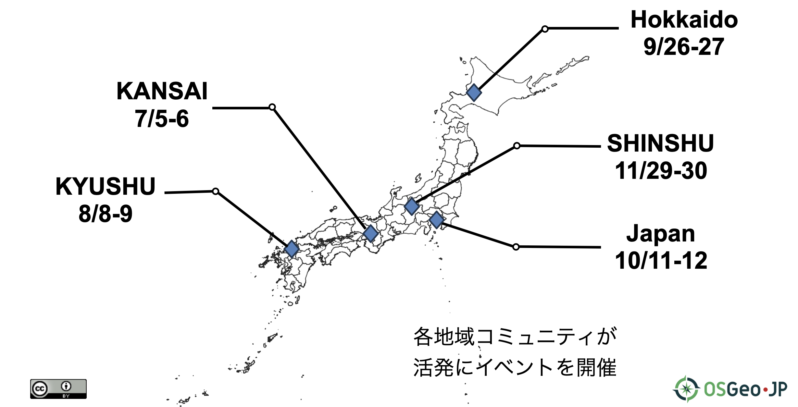
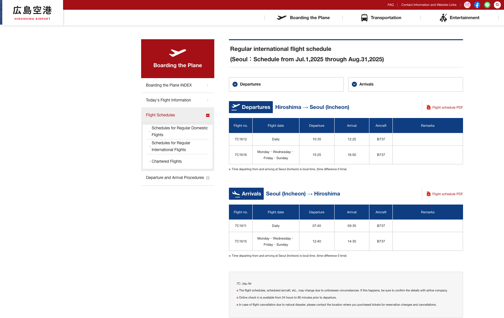
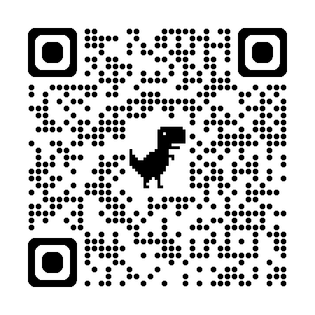

# Introducing OSGeo Japan and FOSS4G Hiroshima

Hinako Iseki / OSGeo Japan

---

## What I'll Talk About Today

- [Self Introduction](#self-introduction)
- [What are OSGeo and OSGeo.JP?](#what-are-osgeo-and-osgeojp)
- [OSGeo.JP Activities](#osgeojp-activities)
- [FOSS4G Events in Japan](#foss4g-events-in-japan)
- [FOSS4G Global](#foss4g-global)

---

<!-- _class: lead -->

# Self Introduction

---

## asahina

System Engineer specializing in GIS 😊
Living in Japan

- Board member of OSGeo Japan Chapter
- UN Smart Maps member
- Regular member of Japan PostgreSQL Users Group

---

## By the way

I participated in FOSS4G ASIA 2023@Seoul 🎉

SOOOOOOO COLD

---

## Thanks

Thank you to the OSGeo Korea team for inviting me to this event!

---

<!-- _class: lead -->

# What are OSGeo and OSGeo.JP?

---

## What is OSGeo (Open Source Geospatial Foundation)?

**OSGeo Foundation** is a non-profit organization that supports open source geospatial software

- **Established in 2006**
- Aims for **democratization** and **popularization** of geospatial information technology

---

## What is OSGeo.JP (OSGeo Japan Chapter)?

**OSGeo.JP** is the official Japanese chapter of OSGeo

- Promoting FOSS4G in Japan
- Fostering GIS engineer and user communities in Japan
- Hosting FOSS4G events

---

## Organizational Structure of OSGeo.JP

---

<!-- _class: lead -->

# OSGeo.JP Activities

---

## Learn More About OSGeo.JP

Visit our official website for detailed information about our organization and activities

**Official Website: https://www.osgeo.jp/**

---

## FOSS4G Lightning Talk 💡

Quick presentations and knowledge sharing events

- 5-minute presentations by participants
- Networking opportunities after sessions
- Held in Tokyo, On-site

---

## FOSS4G Lightning Talk 💡

- Many new people participated 🎈
- Through casual events that can be easily joined, I want to increase the number of people who can present

---

## FOSS4G Mokumoku-kai 👨‍💻

Regular code sprint for learning and development

- Monthly gatherings at Discord
- Focus work on FOSS4G projects
- Share knowledge and solve problems together

---

## Regional FOSS4G Events 🗾

FOSS4G events was held across Japan in 2025

- **FOSS4G Hokkaido**
- **FOSS4G KANSAI**
- **FOSS4G KYUSHU**
- **FOSS4G SHINSHU**

---

## After-Talk Events 🗣️

Discussion sessions following global FOSS4G conferences

- Share experiences from FOSS4G Global and Asia
- Learn about latest trends and atmosphere
  

---

## Participation in Open Source Event

- The Open Source Conference (OSC) showcases the latest trends in open source.

- It is held throughout the year across Japan, from Hokkaido to Okinawa.

---

## Participation in Geo-Exhibition

- This is a joint exhibition where companies and services related to map location information gather together.

---

<!-- _class: lead -->

# FOSS4G Events in Japan

---

## FOSS4G Japan 🇯🇵

**The largest FOSS4G event in Japan with over 200 participants annually!**

- **Content**:
  - Day 1: Hands-on Day (practical workshop day)
  - Day 2: Core Day (presentation day)

---

## FOSS4G 2024 Japan

---

## FOSS4G 2024 Japan

---

## FOSS4G 2025 Japan

- **Date**: October 11-12, 2025
- **Venue**: Senshu University Ikuta Campus (Kawasaki City, Kanagawa Prefecture)
- **Content**:
  - 10/11 (Sat): Hands-on Day (practical workshop day)
  - 10/12 (Sun): Core Day (presentation day)

---

## FOSS4G 2025 Japan

---

## FOSS4G 2025 Japan

---

## We're doing it nationwide too!

---

## Our purpose

- We has been gaining new members through active event hosting and participation in exhibitions.

- Once composed mostly of older members, OSGeo.JP now includes many young people and is full of energy.

---

## With your community 🤝

- Participating in events with South Korea’s youthful GeoNetwork community was very enjoyable.

- I desire to collaborate with South Korea to further energize both communities.

---

<!-- _class: lead -->

# FOSS4G Global

---

## What is FOSS4G Global?

**FOSS4G Global** is the flagship annual international conference organized by OSGeo Foundation

### Overview

- Brings together developers, users, decision-makers, and business professionals
- Features presentations, workshops, code sprints, and networking opportunities

---

## Recent FOSS4G Global Conferences

### Past Events

- **2023**: Prizren, Kosovo 🇽🇰
- **2024**: Belém, Brazil 🇧🇷
- **2025**: Auckland, New Zealand 🇳🇿

---

### FOSS4G 2025 Auckland 🇳🇿

**November 17-23, 2025**

Auckland, New Zealand

---

### Workshops & Learning 📚

**2 days of hands-on workshops**

Participants learned new technologies and skills

---

### Main Conference 🎤

**3 days of presentations and sessions**

Sharing knowledge and innovations in geospatial technology

---

### Booth

- If you become a sponsor, you can place a booth

---

### Community Events 🤝

**2 days of code sprints and collaboration**

- Building software and connections together

- Sightseeing in streets and other areas

---

### Group Photo

The total number of participants is around 400.

About 25 participants are from Japan, making it the third-largest group after New Zealand and Australia.

---

<!-- _class: lead -->

# And next year

---

<!-- _class: lead -->

---

## 🎉 FOSS4G 2026 🎉

### Event Schedule Overview

- August 30 - September 5, 2026
  - August 30-31: Conference
  - September 1-3: Main Conference
  - September 4-5: Code Sprint

**Please reserve your schedule now!**

---

## Venue

- Hiroshima Prefecture, Japan

---

## Hiroshima with Great Access ✈️

**Direct flight from Seoul (Incheon) to Hiroshima in about 2 hours!**

- **Incheon International Airport → Hiroshima Airport**: About 2 hours

---

## Let's Join FOSS4G 2026 Hiroshima!

**We are looking forward to seeing you all in Hiroshima!** 🇯🇵

---

## Mark Your Calendar! 📅

**August 30 - September 5, 2026**

Save the date for FOSS4G 2026 in Hiroshima!

---

## Share Your Knowledge 🎤

**Call for Papers will open soon!**

Submit your talk proposals and share your expertise with the global community

---

## Experience Japanese Culture 🏯

**Discover Hiroshima's rich history and hospitality**

Combine learning with cultural experiences

---

## Eat delicious food 🍚

**Hiroshima is famous for its delicious cuisine!**

Enjoy local specialties during the conference!

---

## Connect with the Community 🤝

**Meet geospatial professionals from around the world**

Network, collaborate, and build lasting friendships

---

## Stay Updated 📢

Visit our Website for the latest information

Follow us on social media for updates!

- X: @osgeojapan
- Facebook: @osgeojapan

---

# See You in Hiroshima!

# 広島で会いましょう！

# 히로시마에서 만나요!

---

<!-- _class: lead -->

# 감사합니다! 🙏

